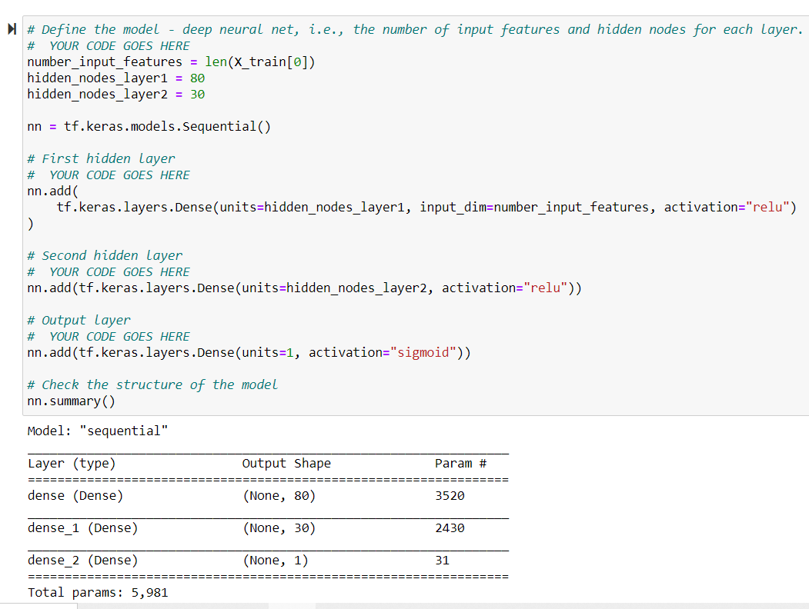
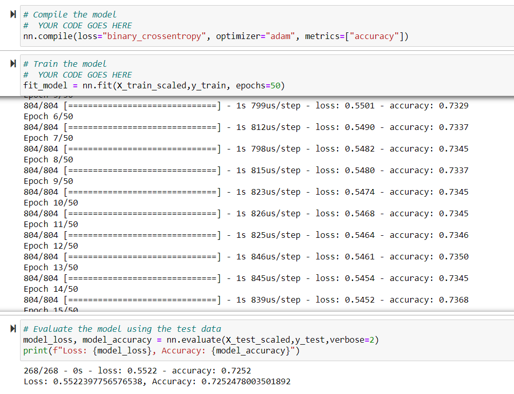
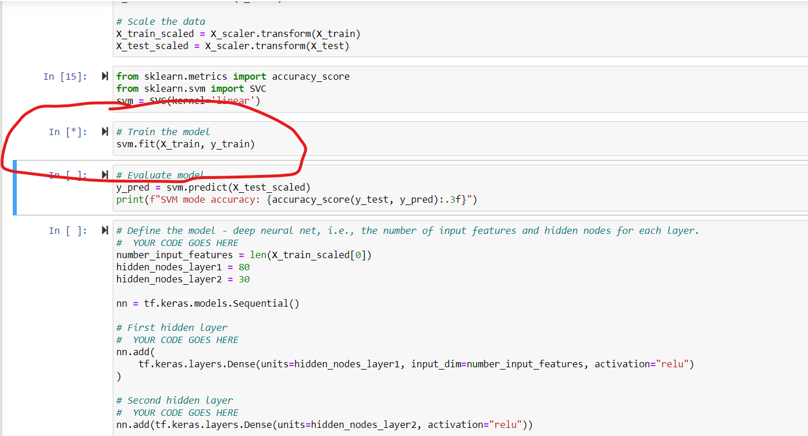
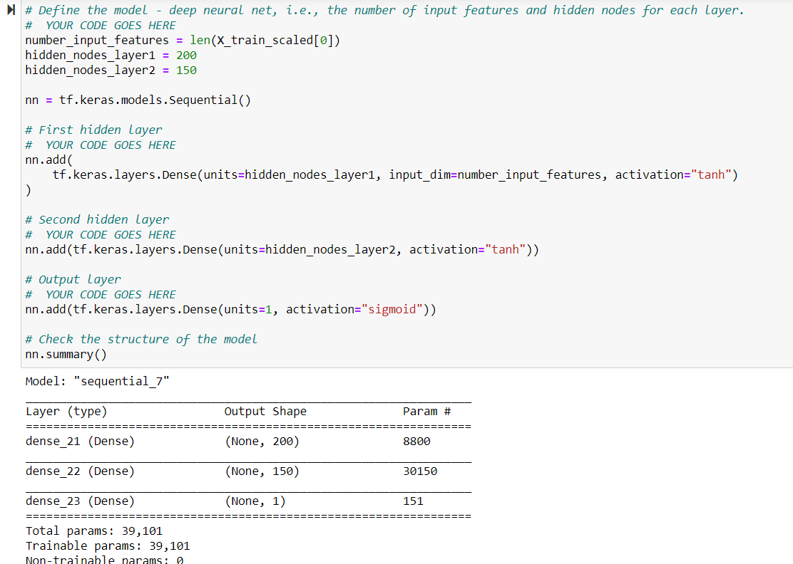
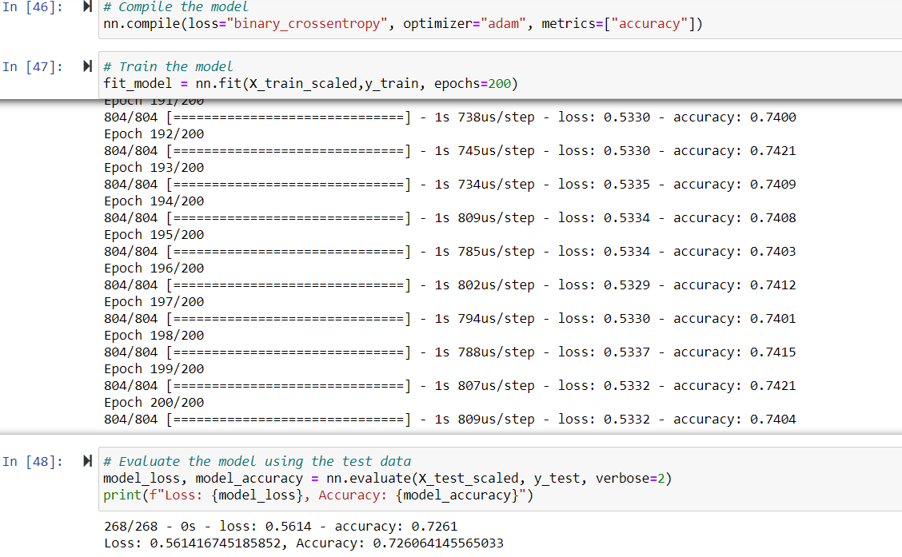
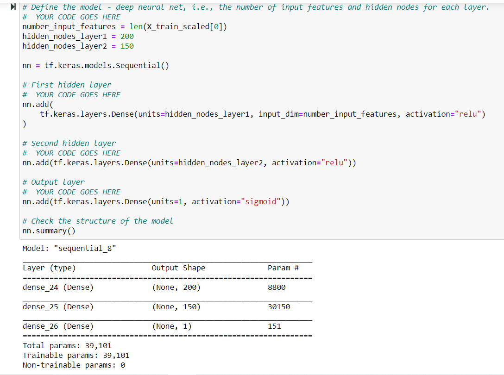
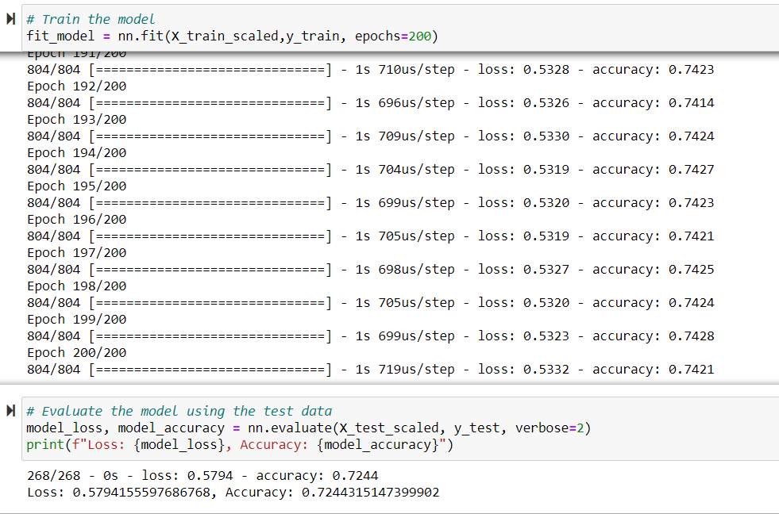

# Neural_Network_Charity_Analysis

In assisting Beck's with figuring which organizations Alphabet Soup should continue to sponsor we've learned a lot about machine learning, more specifically neural networks and deep learning machines. Much like human brains, neural networks will take euqations and correct their results the more times they process the information. In introducing different ways of working the equations, or models, the accuracy can get better. For our issue we want to make sure that the funds that are awarded are used properly by these organizations. We've reviewed our past history, those that have used them successful in using the funds and those that hadn't. These are our results. 

Once the data was received we went right to work on it, prerpcessing empty cells and removing columns that were not needed, like the EIN and Name columns. We binned the the "Application_Type" and "Classification", separating them by their different types then regrouped them with the original dataset. Ran it the the OneHotEncoder to prepare the data and defined or test and train Values. They were then put through the Net neural model and confirmed with checkpoints model. The information provided was formatted to get lower than the 75% accuracy and these were my results when I put them through the model.

# Results
## Data Preprocessing
My results were amazing, the first time I ran the model I received an accuracy of 0.99 and a loss of 0.002. I didn't know what to do for Deliverable 3 since it felt I had already peaked with the intial run. Since it seemed to easy I though it would need further review, after reviewing my model with Beck's (T.A. Joseph) we figured out what was wrong. I was evaluating the "Special_Considerations_Y/N" and of course that would give me an almost perfect score. I had run my model all the way through and the original file saved for AlpahbetCharity.h5 will contain these values. Identifying the issue, I immediately made the correction and my results were mode in line with what was expected. The feature value that was used to evaluate the model was "IS_SUCCESSFUL". The model was run through the tinserflow with 80 processing neurons for the first layer and 30 for the second. The activations was set at "relu" for the first hidden layer and the second, the output was set with the "sigmoid". Initially it had been run for 100 epoch but I reduced it since it didn't see to changed too much after 30 runs. Theses were my results:

They didn't reach 75% accuracy and in attempt to reach it I though running it through a different model might work. I ran it through the SVM model and I waited. I waited for over an hour the first time and it didn't come back. I stopped it and later in the evening I tried running it again and stopped it after 30 minutes. Maybe it would've ran differently in Good Collab, that would be test for another day. 

Then I tried by increasing the neurons, the first layer was increasd to 200 and the second layer to 150. The activation was also changed for hidden layers 1 and 2 to "tanh" and that provided a small increase in accuracy to 0.7260 and a high loss as well. We continued to be unsuccessful. 

Finally I kept the higher Neuron count and changed the activation back to "relu" and produced the similar results. 

# Summary
Overall this was a good learning exercise, during the module had we been through a few ways of trouble shooting the models or more practice may have brought in better results. Although, I was able to recognize something was wrong with the model when my results were over 0.99. The whole topic of machine learning has been eye opening and definietly has sparked an interest in me for future learning on this topic. 

